:::tip
:strawberry::tangerine:从一个界面按登录跳转到另一个界面:lollipop::strawberry::candy:
:::

<!-- more -->

## 效果图

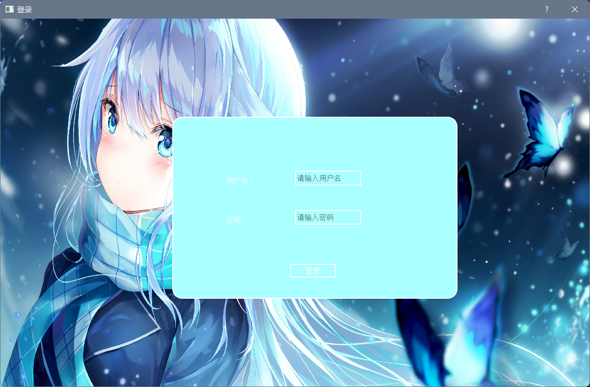

首先在登录界面输入正确的用户名和密码后点击登录，即可跳到第二个Hello World!界面！

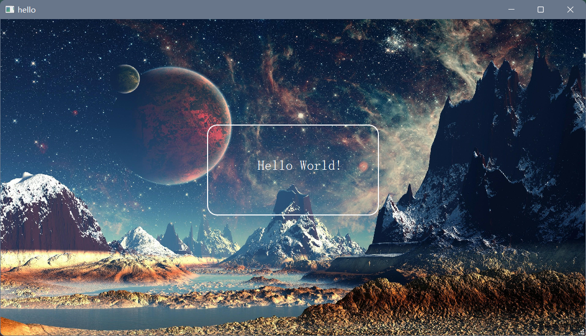

## 如何实现（按照我的步骤来，保证成功！）

### 1.我的文件目录

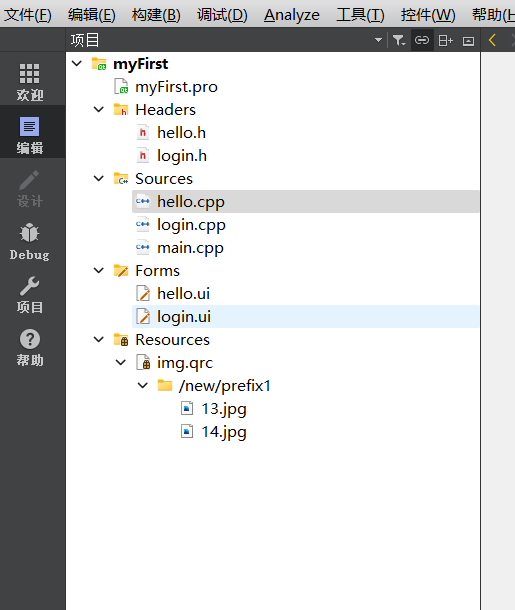

1. 说明：
    - 在我的工程目录下面主要有三个源文件 `hello.cpp`、`login.cpp`、`main.cpp`
    - 其关系是：`main.cpp`是主文件，`login.cpp`是登录界面的文件，点击登录后会跳转到`hello.cpp`hello world页面
    - 然后Resources是我为工程添加的一个资源文件，里面主要放的是页面的背景图片，这个目录可有可无
2. 我在这里假设大家已经有一个主页面，也就是我的`hello.cpp`文件，还要添加一个登录页面,也就是我的`login.cpp`文件，下面详细讲一下其添加步骤
    - 首先右击工程目录，也就是我的`myFirst`，选择添加新文件，然后选择Qt里面的：Qt设计师界面类，再选择choose，如下图：
    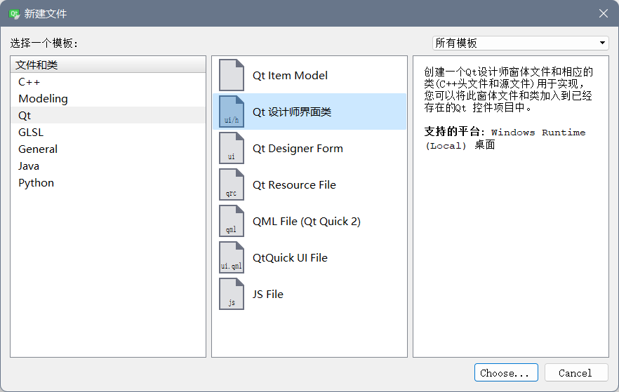
    - 然后选择Dialog without Buttons 再点击下一步：
    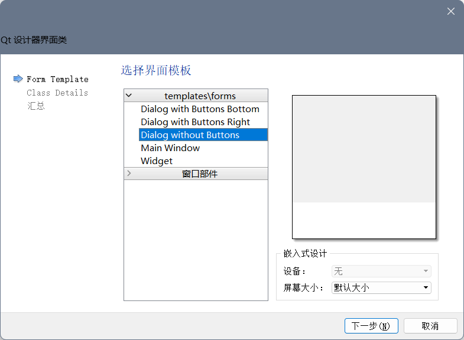
    - 将类名改为和我一样的login 再点击下一步：
    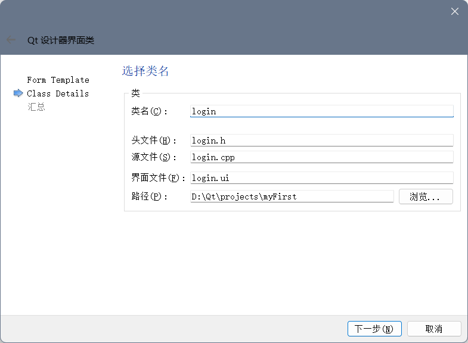
    - 最后点击完成：
    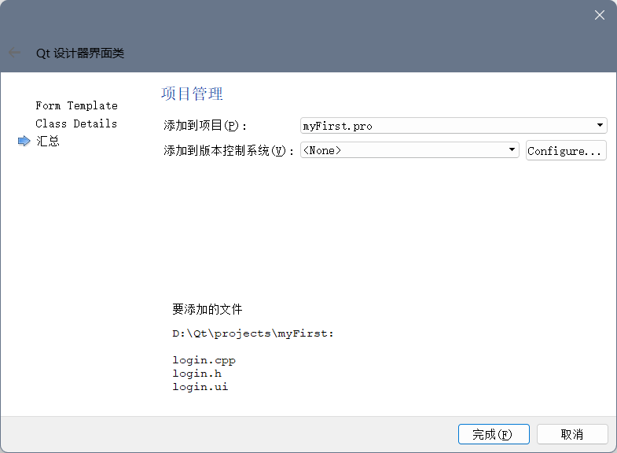
    - 现在你就会看到在你的工程目录下多了`login.cpp`、`login.h`、`login.ui`三个文件

### 2.设计

#### 步骤
1. 双击上面我们新建的`login.ui`文件进入到设计师界面，拖动控件完成以下界面

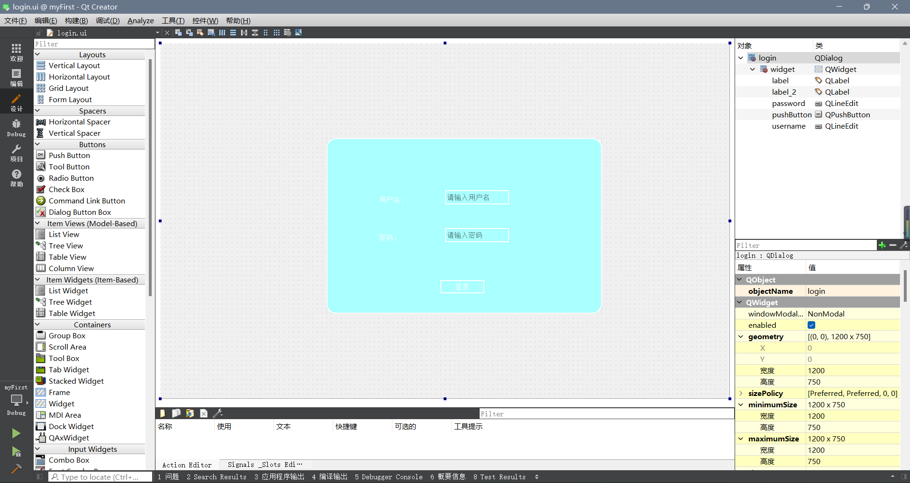

2. 注意事项：
    - 用户名和密码对应的是两个Label标签，两个输入框对应的是Line Edit，并且要在右边的对象栏里面将其对象名分别改为`username`和`password`，**改完名字后一定要点击保存**

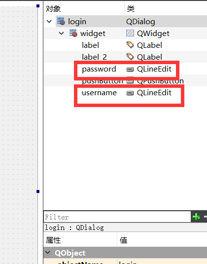

3. 选中登录按钮的pushbutton右击选择转到槽，如下图：

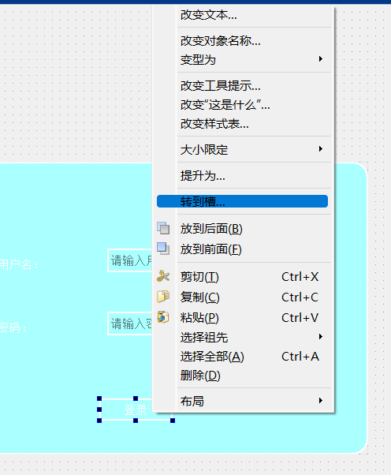

4. 就来到了`login.cpp`的编辑页面

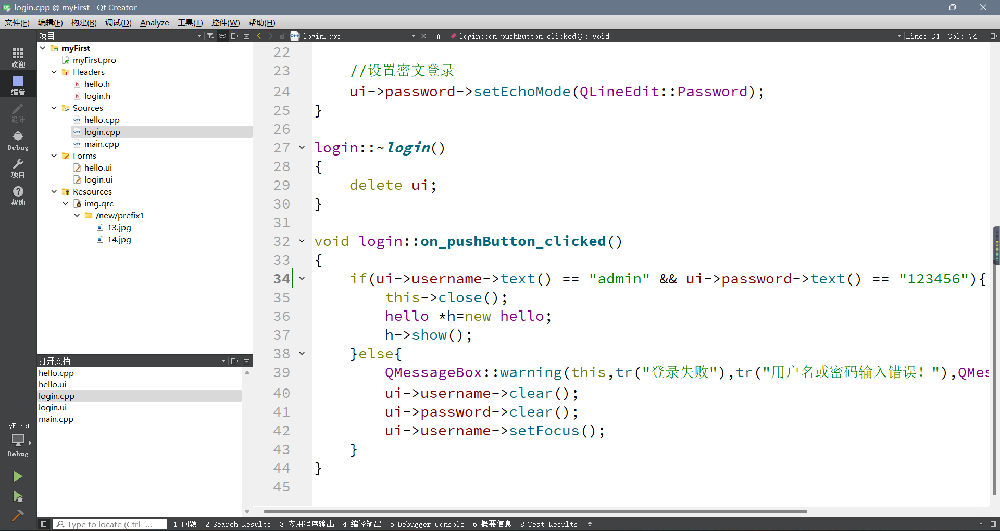

5. 在这个槽函数里面添加如下代码：

```cpp
    if(ui->username->text() == "admin" && ui->password->text() == "123456"){
        this->close();
        hello *h=new hello;
        h->show();
    }else{
        QMessageBox::warning(this,tr("登录失败"),tr("用户名或密码输入错误！"),QMessageBox::Ok);
        ui->username->clear();
        ui->password->clear();
        ui->username->setFocus();
    }
```

6. 一定要在`login.cpp`文件的开头引入`hello.h`头文件，下面是我的`login.cpp`文件代码内容：

```cpp
//login.cpp
#include "login.h"
#include "ui_login.h"
#include <QMessageBox>
#include "hello.h"

login::login(QWidget *parent) :
    QDialog(parent),
    ui(new Ui::login)
{
    ui->setupUi(this);

    //设置背景图片
    QPalette pal = this->palette();
    pal.setBrush(QPalette::Background,QBrush(QPixmap(":/new/prefix1/14.jpg").scaled(this->size())));
    setPalette(pal);

    //设置无边框
//    setWindowFlag(Qt::FramelessWindowHint);

    //设置窗口标题
    this->setWindowTitle("登录");

    //设置密文登录
    ui->password->setEchoMode(QLineEdit::Password);
}

login::~login()
{
    delete ui;
}

void login::on_pushButton_clicked()
{
    if(ui->username->text() == "admin" && ui->password->text() == "123456"){
        this->close();
        hello *h=new hello;
        h->show();
    }else{
        QMessageBox::warning(this,tr("登录失败"),tr("用户名或密码输入错误！"),QMessageBox::Ok);
        ui->username->clear();
        ui->password->clear();
        ui->username->setFocus();
    }
}
```

7. 最后要做的就是在`main.cpp`里面添加以下代码，使我们的登录页面第一个打开，以下是我的`main.cpp`文件内容

```cpp
//main.cpp
#include "login.h"
#include <QApplication>

int main(int argc, char *argv[])
{
    QApplication a(argc, argv);
    login w;
    w.show();

    return a.exec();
}
```

添加完后大功告成！点击运行一下吧

8. 其实到这里应该就可以构建并运行了，下面我说一下其他几个文件

`hello.cpp`、`hello.h`和`login.h`里面不需要做任何改动，其中`login.h`完全是自动生成的。
