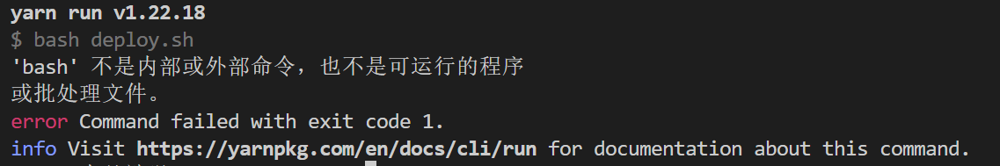
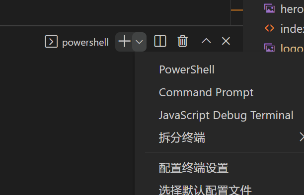
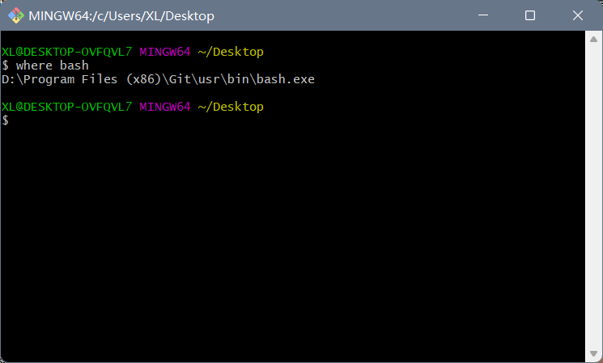
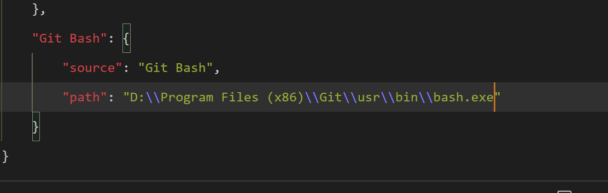
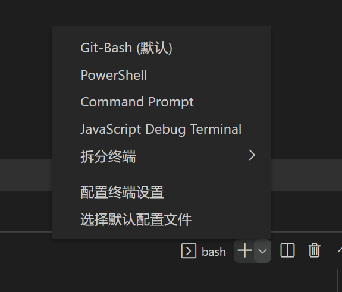

:::tip
:strawberry::tangerine:关于如何解决VScode中git bash终端失效问题:lollipop::strawberry::candy:
:::

<!-- more -->

## 这两天在使用git时遇见了一些问题

1. 在VScode编辑器中，终端老是出现问题自动终止进程并退出，并执行 bash 命令失败。

- 在我重启VScode后，再次打开终端默认的是PowerShell,我原来以为是系统内存不够用导致终端终止的，结果当我执行`yarn deploy`脚本命令，执行`"bash deploy.sh"`的时候出了如下的问题



- 我就纳闷了,怎么之前都还好好的，这下突然不行了，当我打开终端的下拉选项，才发现我的Vscode里面压根就没有Git-Bash,难怪会执行失败。



## 解决办法

### 1. 首先，我想到的是要不要试试重新安装一下Git (**不能解决！！！**)

于是乎我卸载了原来安装的Git，去重新官网下载并安装了Git，后来我发现的确是能在PowerShell里面执行"bash deploy.sh"命令了，我以为这件事就这样解决了。结果第二天当我运行终端过程中，又双叒叕出现了终端异常终止的问题，我怀着试一下的心态，再次执行`yarn deploy`指令，果然不出我所料：“ 'bash' 不是内部或外部命令，也不是可运行的程序或批处理文件 ”

我就想完了，昨天重新下载 Git 白忙活了，并没有解决根本问题，我很不服气，于是在该文件夹里面点击右键执行 `git bash here` 在这里再次执行`yarn deploy`，发现这里可以完美运行，顿时我眼前一亮，把终端换成`git bash`是不是就可以直接在VScode 里面执行该命令了呢？可是我的VScode 里面又没有 `git bash` 这个终端，这.......


### 2. 我想在VScode里面直接使用 Git Bash 终端来执行 `bash` 命令(完美解决，可行)

后来我就百度、CSDN到处查找解决方法，功夫不负有心人，我在CSDN上找到了一篇解决相关问题的博客，博主说的很详细，把我之前添加 Git Bash 到 VScode 中失败的问题给解决了。[原文链接](https://blog.csdn.net/qq_50090137/article/details/120092877)

我简化一下步骤：

  - 在VScode中依次点击：文件-->首选项-->设置-->功能-->终端-->在settings.json中编辑

配置好如下代码：

```json
"terminal.integrated.profiles.windows": {
        "PowerShell": {
            "source": "PowerShell",
            "icon": "terminal-powershell"
        },
        "Command Prompt": {
            "path": [
                "${env:windir}\\Sysnative\\cmd.exe",
                "${env:windir}\\System32\\cmd.exe"
            ],
            "args": [],
            "icon": "terminal-cmd"
        },
        "Git-Bash": {
            "path": "D:\\Program Files (x86)\\Git\\user\\bin\\bash.exe",
            "args": [],
        }
    },
    "terminal.integrated.defaultProfile.windows": "Git-Bash",// 启动终端默认为“git bash”
```

::: warning
需要的别注意的是最后"Git-Bash"里面的配置
:::

#### 2.1. 注意细节

1. 使用Git-Bash或者GitBash，**不要使用**Git Bash

2. 不要在GitBash中，既添加path又添加source，亲测会失效。

3. path 里面的路径是绝对路径

4. 查找bash.exe的路径方法：
    - 在任意文件夹里面或桌面右击选着"git bash here"
    - 输入`where bash`
    - 出现的路径就是bash所在的路径
    - 注意添加到`settings.json`中是要对`\`进行转义

5. 如下图所示：





6. 添加成功并保存后，重启VScode就能看到如下效果，也能在VScode终端里面执行`bash`相关命令了



至此，完美解决！！:tada::tada::tada: