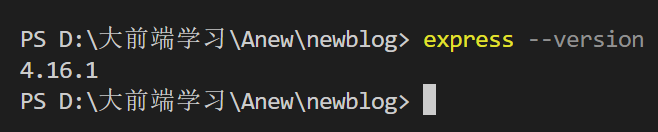
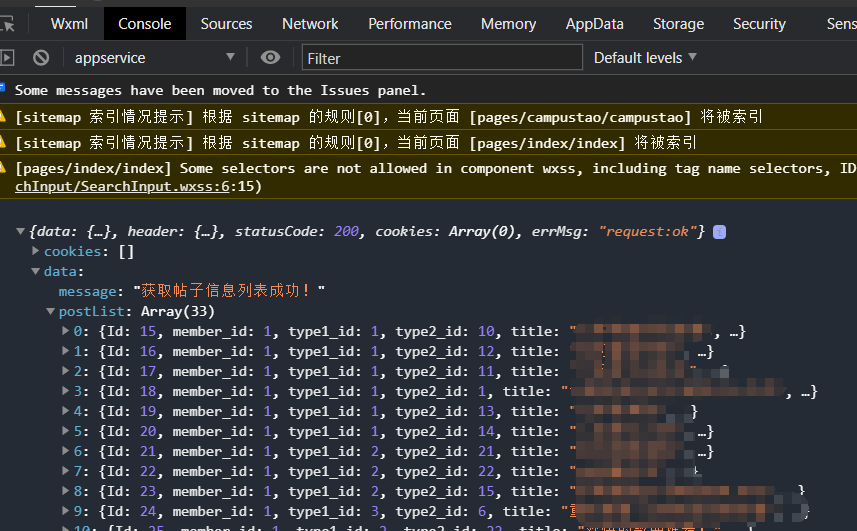

:::tip
学习微信小程序，并使用node.js自己开发后台接口
:::

<!-- more -->

## 灵感

昨天晚上，自己把毕业设计的小程序前端页面静态搭建的有那么一点味儿了，于是想在今天使用前几天刚学完的node.js来现学现用一下，尝试自己开发后台的接口，而不是用之前的假数据。所以我就百度、CSDN到处逛了一圈，看看大神都是如何用node.js来写小程序后台接口的，找了很多相关教程，终于找到了一篇激发我灵感的教程，[原文链接](https://blog.csdn.net/qszirui/article/details/102743273?ops_request_misc=&request_id=&biz_id=102&utm_term=node.js%E5%BC%80%E5%8F%91%E5%BE%AE%E4%BF%A1%E5%B0%8F%E7%A8%8B%E5%BA%8F&utm_medium=distribute.pc_search_result.none-task-blog-2~all~sobaiduweb~default-4-102743273.nonecase&spm=1018.2226.3001.4187)。特别是里面的`res.json()`给了我很大的启发，原来是通过这个方法发送`JSON`数据，相见恨晚啊，之前学习B站上面的node.js相关视频，老师也是藏着掖着，不给我们讲完！！

## 寻找

这篇博客写的很浅显易懂，给我引了个苗子后，我自己又去查之前买的node.js相关的书籍，果然在《Node.js应用开发》一书中也提到过相关的知识,我一来兴趣顿时就连着看了下去，把重要的几页都做了标记，因为待我看的差不多的时候已经很晚了，具体操作还是留给第二天去实际操作验证一下吧。

## 操作步骤

于是今天一大早，就开始来尝试自己用node.js写后端接口，听着就很酷是不是。

### 1. 准备工作

:::tip
（1）全局安装`Express`
:::

```bash
npm install express -g
```

:::tip
（2）全局安装`Express`生成器`express-generator`
:::

```bash
npm install express-generator -g
```

:::tip
（3）查看`Express`版本
:::

```bash
express --version
```

如果出现如下图所示这样就表示安装成功了！



### 2. 使用Express生成项目

:::tip
（1）在CMD窗口中切换路径到想要创建项目包的目录，输入以下命令（项目名为英文，自取）
:::

```bash
express projectName
```

:::tip
（2）进入项目目录并安装依赖包
:::

```bash
cd projectName
npm install
```

:::tip
（3）启动项目
:::

```bash
npm start
```

之后就可以在浏览器输入`localhost:3000`，会看到express的欢迎页，就说明项目搭建成功，并启动了服务器，监听的是3000端口。（3000是express默认的端口，自己也可以在配置文件里面修改实际端口会得到同样的效果）

### 3. 创建Router级别路由

在routes目录下创建一个名为`post.js`的文件

```js
// post.js

// 获取帖子信息的路由
const express = require('express')
const router = express.Router()

// 导入需要的处理函数模块
const post_handler = require('../router_handler/post')

// 获取帖子信息的路由
router.get('/postInfo', post_handler.getPostInfo)
// 发布帖子的路由
router.post('/add', post_handler.addPost)

// 对外暴露接口
module.exports = router
```

### 4. 创建路由处理函数模块

在项目根目录下，与routes同级创建一个名为router_handler的文件夹，并在该文件夹下创建一个名为`post.js`的文件。

```js
// post.js
// 帖子的处理函数模块

// 导入数据库连接模块
const db = require('../db/index')

// 获取帖子信息列表的处理函数
exports.getPostInfo = (req, res) => {
  // 定义查询帖子信息列表的 SQL 语句
  const sql = 'select Id,member_id,type1_id,type2_id,title,content,DATE_FORMAT(createtime,"%Y-%m-%d") as adddate,DATE_FORMAT(now,"%Y-%m-%d %H:%i:%s") as addtime,discussnum,is_delete,img_src from tb_post order by id asc'
  // 调用 db.query 执行 SQL 语句
  db.query(sql, (err, results) => {
    if (err) return res.cc(err)
    // 以JSON格式响应数据给客户端
    res.json({
      status: 0,
      message: '获取帖子信息列表成功！',
      postList: results,
    })
  })
}

// 发布帖子的处理函数
exports.addPost = (req, res) => {
  res.send('okok')
}
```

### 5. 创建连接数据库的模块

在上一步中有对数据库进行操作的代码，肯定就少不了引入`mysql`模块，所以还需要创建一个连接数据库的模块

在项目的根目录下，创建一个名为`db`的文件夹，并在该文件夹下创建一个名为`index.js`的文件

```js
// index.js
const res = require('express/lib/response')
const mysql = require('mysql')

const db = mysql.createPool({
  host: "hostname", // hostname可以是服务器域名，也可以是服务器IP地址
  user: "username", // 数据库用户名
  password: "password", // 数据库密码
  database: "databasename", // 要连接的数据库名
})

module.exports = db
```

### 6. 启动服务器

最后也是最重要的一步，在项目的入口文件`app.js`中导入路由模块以及注册路由，也叫挂载

```js
// app.js
var postRouter = require('./routes/post')
app.use('/api', postRouter)
```

当然项目中如果用到了一些中间件，一定要在路由模块之前封装这个中间件函数，比如下面这个返回错误信息的中间件函数`res.cc()`就需要写在在上一步之前

```js
// app.js
// 一定要在路由之前，封装 res.cc 这个中间件函数
app.use((req, res, next) => {
  // status 默认值为1，表示失败的情况
  // err 的值，可能是一个错误对象，也可能是一个错误的描述字符串
  res.cc = function (err, status = 1) {
    res.send({
      status,
      message: err instanceof Error ? err.message : err
    })
  }
  next()
})
```

:::tip
在终端里面启动服务器
:::

```bash
npm start
```

:::tip
最后在微信开发者工具里面测试一下新鲜的接口吧！
:::

### 7. 小程序里面测试接口

在需要使用接口的小程序页面的`js`文件中添加如下代码

```js
page{
  data:{
    postList:[]
  },
  /**
   * 生命周期函数--监听页面加载
   */
  onLoad: function (options) { 
    wx.request({
      url: 'http://localhost:3000/api/postInfo',
      success: (result) => {
          console.log(result);  // 用于在开发者工具中调试器检测接口是否能正确返回数据
          this.setData({
            postList: result.data.postList
        })
      },
    });
  },
}
```

若在调试器界面看到如下所示界面，就说明接口开发成功！！



完成以上所有操作就大功告成了！:tada::lollipop::strawberry::candy::tada: